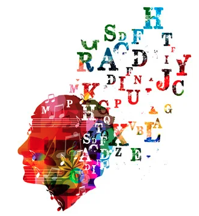

### An Empirical Exploration of Cross-domain Alignment between Language and Electroencephalogram  
William Han*, [Jielin Qiu*](https://www.cs.cmu.edu/~jielinq/), [Jiacheng Zhu](https://jiachengzhuml.github.io/), [Mengdi Xu](https://mxu34.github.io/), [Douglas Weber](https://www.meche.engineering.cmu.edu/directory/bios/weber-douglas.html), [Bo Li](https://aisecure.github.io/), [Ding Zhao](https://safeai-lab.github.io/)

Under Review / [arxiv](https://arxiv.org/abs/2208.06348)
