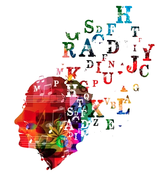

# An Empirical Exploration of Cross-domain Alignment between Language and Electroencephalogram  
William Han<sup>*</sup>, [Jielin Qiu<sup>*</sup>](https://www.cs.cmu.edu/~jielinq/), [Jiacheng Zhu](https://jiachengzhuml.github.io/), [Mengdi Xu](https://mxu34.github.io/), [Douglas Weber](https://www.meche.engineering.cmu.edu/directory/bios/weber-douglas.html), [Bo Li](https://aisecure.github.io/), [Ding Zhao](https://safeai-lab.github.io/)

Under Review / [arxiv](https://arxiv.org/abs/2208.06348)


## Usage

### Set up Environment

Create a virtual environment and activate it. 

```
python -m venv .env

source .env/bin/activate
```

Install basic requirements.

```
pip install -r requirements.txt
```

### Download Datasets

Download K-EmoCon Dataset [here.](https://zenodo.org/record/3931963)

Download ZuCo Dataset [here.](https://osf.io/q3zws/)

For ZuCo Dataset, please only download task1 and task3.


### Set up directories


